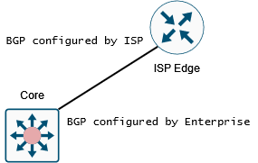

# Border Gateway Protocol (BGP)

## Overview

External BGP (eBGP) facilitates the connection of BGP peers across distinct autonomous systems for the purpose of exchanging routing updates. On the other hand, Internal BGP (iBGP) enables the connection of BGP peers within the same Autonomous System.

<main></main>

A BGP speaker doesn't automatically identify and establish a connection with another BGP speaker. The relationships between BGP speakers need to be manually configured. A BGP peer refers to a BGP speaker that maintains an active TCP connection with another BGP speaker.

BGP operates in the following manner:

- BGP utilizes TCP port 179 to establish a TCP session with a peer.
Upon establishing a TCP connection between peers, each BGP peer initially shares all of its routes, which is the complete BGP routing table, with the other peer.

- After this initial exchange, BGP peers only send incremental updates when there's a change in the network topology or a routing policy change.

- During periods of inactivity between these updates, peers exchange special messages known as keep-alives.

### Configuration

NOTE: Cisco Nexus switches support BGPv4 only.

<pre>
feature bgp
router bgp 65000
  router-id 10.10.10.10
  address-family ipv4 unicast

  neighbor 209.165.201.2 remote-as 65001
    description "Connection to ISP1"
    address-family ipv4 unicast

  neighbor 192.168.16.2 remote-as 65000
    description internal peer Core-2
    update-source Loopback 0
    address-family ipv4 unicast
    next-hop-self
</pre>

<main></main>

In this figure, the Enterprise configured BGP on the two core routers, and the ISP configured BGP on their end accordingly.

## BGP Path Selection

### Step 1: Comparing Pairs of Paths

1. Select a valid path for comparison. (Paths with unreachable next-hops are invalid.)
2. Choose the path with the highest weight.
3. Choose the path with the highest local preference.
4. Prefer locally originated paths.
5. Choose the path with the shorter AS-path.
6. Choose the path with the lower origin. (IGP is lower than EGP.)
7. Choose the path with the lower multi-exit discriminator (MED).

### Step 2: Determining the Order of Comparisons

1. Paths are divided into groups. MED is compared within each group using the same rules as in step 1. Typically, one group is chosen for each neighbor autonomous system. If 'bgp bestpath med always' is configured, one group containing all paths is chosen.
2. The best path in each group is determined by comparing all paths in the group and keeping the best one so far. If a new path is better, it becomes the new temporary best path.
3. A set of paths containing the best path from each group is formed. The overall best path is selected from this set by comparing them as in step 2.

## MP-BGP

Multiprotocol BGP (MP-BGP) is an extension to BGP that enables it to carry routing information for multiple network layer protocols (e.g., IPv4, IPv6, and VPNs) in a single BGP session.

<pre>
interface ethernet 1/1
  ipv6 address 2001:0DB8::1 
!
router bgp 65536
  neighbor 192.168.1.2 remote-as 35537
    address-family ipv4 multicast
    address-family ipv6 multicast 
</pre>

## BGP Default Parameters

<table>
  <thead>
    <tr>
      <th>Parameter</th>
      <th>Default</th>
    </tr>
  </thead>
  <tbody>
    <tr>
      <td>Administrative distance—External (from eBGP)</td>
      <td>20</td>
    </tr>
    <tr>
      <td>Administrative distance—Internal (from iBGP)</td>
      <td>200</td>
    </tr>
    <tr>
      <td>Administrative distance—Local (originated by itself)</td>
      <td>220</td>
    </tr>
    <tr>
      <td>BGP feature</td>
      <td>Disabled</td>
    </tr>
    <tr>
      <td>Keepalive interval</td>
      <td>60 seconds</td>
    </tr>
    <tr>
      <td>Hold timer</td>
      <td>180 seconds</td>
    </tr>
    <tr>
      <td>BGP PIC core</td>
      <td>Enabled</td>
    </tr>
    <tr>
      <td>Auto-summary</td>
      <td>Always disabled</td>
    </tr>
    <tr>
      <td>Synchronization</td>
      <td>Always disabled</td>
    </tr>
  </tbody>
</table>