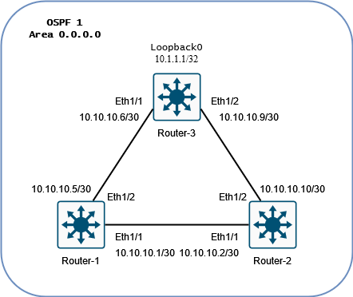

# Protocol Independent Multicast (PIM)

## Overview

Layer 2 Protocols

- IGMP (Internet Group Management Protocol)
  - IPv4
  - Snooping
- MLD (Multicast Listener Discovery)
  - IPv6

Layer 3 Protocols

- PIM (Protocol Independent Multicast)
  - Creates the multicast tree.W

Connects sources to destinations that want to receive the multicast traffic.

The network needs to be converged at layer 3 before PIM usage.

PIM routers discover eachother via Hellos on 224.0.0.13 for IPv4, and FF02::0 for IPv6.

Two types of routes:

- (*, G) - Any source to a group
- (S, G) - Specific source to a group

### PIM Sparse Mode

Problem is that teh receivers don't know where the source of the traffic they want to receive is, and teh source of the traffic does not know who wants it.

The **RP (Rendezvous Point)** is a router that is known to all routers in the network, and is the root of the multicast tree.

Example traffic flow:

1. Receiver joins the network and says it wants to *JOIN* the 239.1.1.2 group.

2. The first upstream router will hear this and do the following:

      1. Install the multicast route (*, 239.1.1.2) to its multicast routes.

      2. Add the receiving interface to its **OIL (Outgoing Interface List)**.

      3. The router knows the IP address of the RP, so it performs a **RPF (Reverse Path Forwarding)** check to find out which interface the RP is reachable from.

      4. The router sends a *JOIN* request to the RP, saying it would like to be added to the 239.1.1.2 group.

3. The RP receives the join request from the router and does the following:

      1. Adds (*, 239.1.1.2) to its multicast routes.

      2. Add the receiving interface to its **OIL (Outgoing Interface List)**.

*At this stage in the process, the client to RP path is complete. (Bottom half of the tree)*

4. The multicast source (IP of 10.1.1.1) starts to speak on 239.1.1.2.

5. The first upstream router receives the incoming multicast traffic and **encapsulates the traffic in a UDP** packet with a destination of the RP.

6. The RP receives the UDP packet and **decapsulates** the packet, and does the following:

      1. Adds (10.1.1.1, 239.1.1.2) to its multicast routes.

      2. Performs a **RPF (Reverse Path Forwarding)** check to find out which interface the source is reachable from.

      3. The router sends a *JOIN* request towards the source.

Because each routers initially builds its **RPT (Rendezvous Point Tree)** it can lead to inefficient routes. This is why each router then builds its own **SPT (Shortest Path Tree)** to the source.

Prune messages can then be sent to the RP to prune the RPT.

### PIM Roles

#### General Roles

- DR (Designated Router)

    - Used by IGMP and MLD.

    - Used to send out the *JOIN* messages.

    - Is determined by the highest IP address upstream.

- DF (Designated Forwarder)

    - Used by IGMP and MLD.

    - Used to send out the multicast traffic.

#### RP Discovery

- Static

    - Manually configured RP address on each router.

- Auto-RP

    - Made by Cisco

    - Sparse-Dense Mode 

    - Routers advertize that they can be a RP on 224.0.1.39.

    - Mapping Agent then sends that info to the network via 224.0.1.40.

- BSR (Bootstrap Router)

    - Open standard

    - PIMv2
        - PIM messaging sent to 224.0.0.13.

- Anycast RP

    - Uses same IP on two different routers.

    - Uses **MSDP (Multicast Source Discovery Protocol)** to sync the RP's, and avoid a split brain situation.

## Configuration

Note that bsr-candidate and rp-candidate are commands for BSR only. For Auto-RP, use auto-rp rp-candidate, and mapping-agent.

<main></main>

<pre>
Setup PIM on all routers

feature pim
!
interface Eth1/1
  ip pim sparse-mode
  no shutdown
!
interface Eth1/2
  ip pim sparse-mode
  no shutdown

show ip pim neighbor
</pre>

<pre>
Setup Static-RP on Router-1

ip pim rp 10.10.10.2 group-list 239.0.200.0/24

show ip pim rp
</pre>

<pre>
Setup BSR on Router-1

ip pim bsr bsr-candidate Eth1/1
!
ip pim bsr listen

show ip pim rp
</pre>

<pre>
Setup Auto-RP on Router-2

ip pim auto-rp rp-candidate Eth1/1 group-list 239.0.0.0/24 bidir
ip pim auto-rp mapping-agent Eth1/1
ip pim auto-rp forward listen

show ip pim rp
</pre>

<pre>
Setup Anycast-RP on Router-3

interface Loopback0
  ip address 10.1.1.1/32
  ip router ospf 1 area 0
  no shutdown
!
ip pim anycast-rp 10.1.1.1 10.10.10.6
ip pim anycast-rp 10.1.1.1 10.10.10.9

Setup Mapping and Forwarding on Router-2

ip pim auto-rp mapping-agent Eth1/1
ip pim auto-rp forward listen

Router-3: show ip pim rp
</pre>

<pre>
Setup SSM on Router-1

ip ssm range 239.0.100.0/24

show ip pim group-range
</pre>

<pre>
show ip mroute
</pre>
