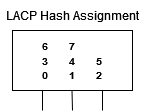

# Link Aggregation Control Protocol (LACP)

## Overview

Link Aggregation Control Protocol (LACP) is a protocol that allows multiple physical links to be bundled into one logical link. LACP allows a network device to negotiate an automatic bundling of links by sending LACP packets to the peer (directly connected device that also implements LACP).

LACP is defined by the IEEE in the **802.3ad & 802.1AX** standards.

<main>

</main>

### Load Balancing

LACP load balancing uses a hash that returns a number typically between 0 and 7. **The hash is based on the source and destination MAC address, IP address, and TCP/UDP port numbers**. The hash is then used to determine which link in the bundle the packet will be sent out of.

Due to the law of averages, it is always advised to use a number of links that is a power of 2 (2, 4, 8, 16, etc.) to ensure that the load balancing is as even as possible.

## Benefits

Benefits and advantages of Port-Channels:

- Optimized bandwidth usage

- Improved network convergence

- Spanning-tree mitigation

- Resiliency against physical link failures

## Specifications

The following items must match on all ports in a Port-Channel:
- Speed & Duplex
- VLAN Details
- Port-Channel Number
- Port-Channel Protocol (LACP/Static)
- Port-Channel Mode (active/passive/on)

### Data Center Specifics

Nexus 9000 series devices support Port-Channels for up to **36 active links**, on both Layer 2 and Layer 3 interfaces.

The protocol PAgP is not supported on the NX-OS platform.

### Channel Modes

<table>
  <thead>
    <tr>
      <th>Channel Mode</th>
      <th>Port Description</th>
    </tr>
  </thead>
  <tbody>
    <tr>
      <td>Passive (LACP)</td>
      <td>Responds to LACP packets that it receives, does not initiate LACP negotiation</td>
    </tr>
    <tr>
      <td>Active (LACP)</td>
      <td>Initiates negotiations with other ports by sending LACP packets</td>
    </tr>
    <tr>
      <td>On (static)</td>
      <td>Does not send any LACP packets, does not join any LACP channel groups, becomes an individual link with that interface</td>
    </tr>
  </tbody>
</table>

### Channel Compatibility

<table>
  <thead>
    <tr>
      <th></th>
      <th>Passive</th>
      <th>Active</th>
      <th>On</th>
    </tr>
  </thead>
  <tbody>
    <tr>
      <td>Passive</td>
      <td>NO</td>
      <td>YES</td>
      <td>NO</td>
    </tr>
    <tr>
      <td>Active</td>
      <td>YES</td>
      <td>YES</td>
      <td>NO</td>
    </tr>
    <tr>
      <td>On</td>
      <td>NO</td>
      <td>NO</td>
      <td>YES</td>
    </tr>
  </tbody>
</table>

## Configuration

Configurations added to the Port-Channel interface will be applied to all physical interfaces in the channel group. (other than port-channel related commands, trunking, and shutdown)

<pre>
Enable LACP
<code>(config)# feature lacp</code>
</pre>

<pre>
Configure LACP
<code>(config)# interface <i>type slot / port</i></code>
<code>(config-if)# channel-group <i>number</i> mode { active | on | passive }</code>
</pre>