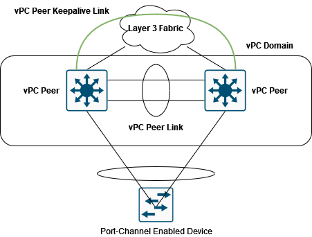
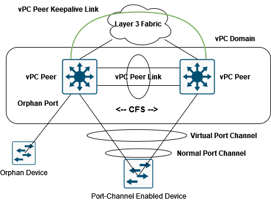
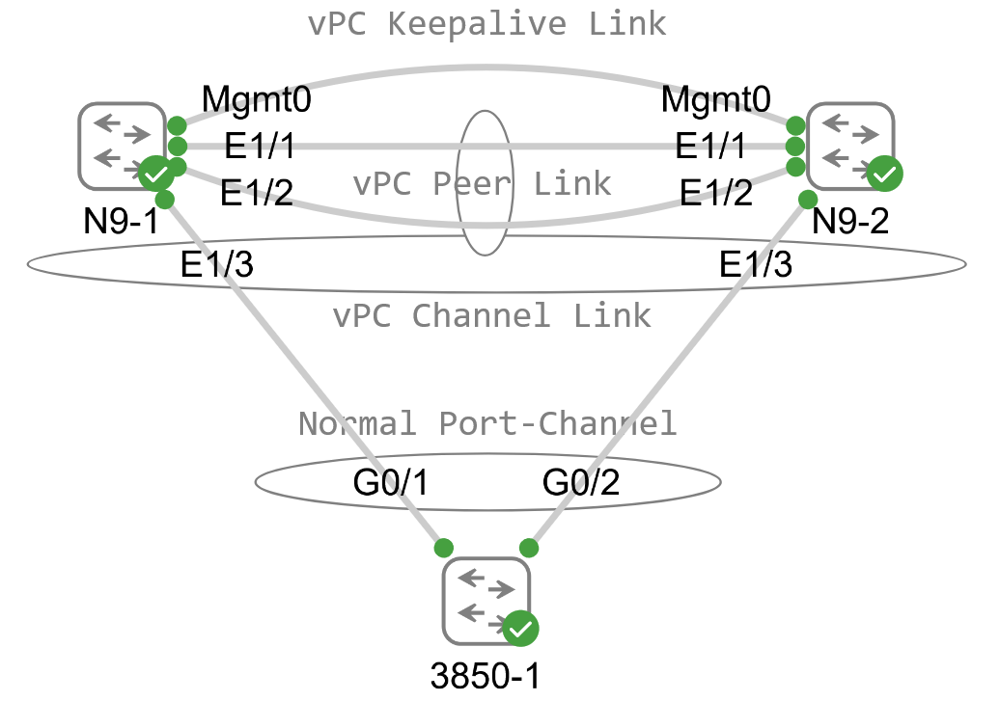
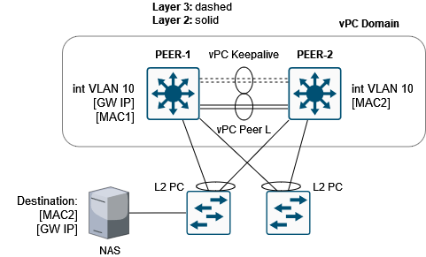
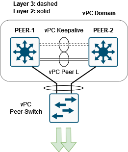

# Virtual Port Channels (vPC)

## Overview

Two Cisco Nexus switches utilizing vPC appear as a single logical Layer 2 switch to other downstream network devices. Despite this, the two switches continue to be separately managed entities with distinct management and control planes.

Benefits of vPC includes:

- Enables utilization of port channel spanning two upstream devices
- Removes STP ports
- Establishes a topology free of loops
- Utilizes the full uplink bandwidth available
- Ensures quick convergence in case of link or device failure
- Offers resilience at the link level
- Contributes to high availability

## Part Breakdown

<main></main>
<main></main>

1. **vPC**: Allows a downstream device to connect to two vPC peers as if they were a single switch, using either a static or LACP-negotiated port channel. vPC is a multi chassis EtherChannel (MEC) technology.

2. **vPC Peers**: In vPC architecture, two Cisco Nexus switches form a duo, functioning together as one logical switch.

3. **vPC Peer Link**: Essential for vPC operation, this link connects two vPC switches, simulating a single control plane. It forwards specific protocol packets, synchronizes MAC tables and IGMP entries, handles multicast and orphaned port traffic, and carries HSRP packets in Layer 3 switches.

4. **vPC Peer Keepalive Link**: A logical, often out-of-band link, this serves as a secondary test to verify remote peer functionality in vPCs. It transmits only operational status IP packets and helps determine peer status when the main link fails.

5. **vPC Domain**: This encompasses the vPC peers, keepalive and peer links, and all connected port channels. Each vPC domain is uniquely identified by a numerical ID, and only one ID is permitted per device.

6. **vPC Member Port**: A port on a vPC peer, part of a configured vPC.

7. **Orphan Device**: A device connected to a vPC domain using regular links instead of a vPC.

8. **Orphan Port**: A port connected to an orphan device, or a vPC port connected to only one vPC peer, usually due to a lost connection on the other peer.

9. **Cisco Fabric Services (CFS)**: This protocol enables fast, reliable configuration messaging and synchronization between vPC peers. It ensures MAC addresses and other data are consistent across both switches, operates over the peer link without user configuration, and incorporates modified spanning tree to maintain continuous operation.

   Cisco Fabric Services (CFS) performs the following operations, as the primary control plane functions over the vPC Peer Link:

      - Aligns MAC address table entries
      - Aligns entries of the Internet Group Management Protocol (IGMP) snooping
      - Shares crucial configuration details to maintain configuration uniformity between the vPC peer switches
      - Monitors the vPC status on the peer
      - Aligns ARP tables (applicable for Layer 3 vPC peers)

NOTE: Traffic sent over the vPC Peer Link is tagged with a special header, telling its peer NOT to forward it out of any of its vPC ports.

## Configuring vPC

Configuring a vPC setup includes the following steps:

1. Activate the vPC feature.
2. Establish a vPC domain and enter into vpc-domain mode.
3. Set up the vPC peer keepalive link between switches.

  (Optional) Set the system priority.

  (Optional) Define the vPC role priority.

4. Establish the vPC peer link.
5. Transition the PortChannel to vPC.

<main></main>

<pre>
Nexus9K #1

feature vpc
!
vpc domain 100
  peer-keepalive destination 1.1.1.2 source 1.1.1.1 vrf Management
!
interface Mgmt0
  description vPC Keepalive
  ip address 1.1.1.1/24
!
interface Ethernet1/1
  description vPC Peer-Link Member
  switchport mode trunk
  channel-group 1 mode on
!
interface Ethernet1/2
  description vPC Peer-Link Member
  switchport mode trunk
  channel-group 1 mode on
!
interface Ethernet1/3
  description vPC Channel Member
  switchport mode trunk
  channel-group 10 mode active
!
interface port-channel 1
  description Peer-Link Interfaces
  vpc peer-link
!
interface port-channel 10
  description vPC Channel
  vpc 10
</pre>

<pre>
Nexus9K #2

feature vpc
!
vpc domain 100
  peer-keepalive destination 1.1.1.1 source 1.1.1.2 vrf Management
!
interface Mgmt0
  description vPC Keepalive
  ip address 1.1.1.2/24
!
interface Ethernet1/1
  description vPC Peer-Link Member
  switchport mode trunk
  channel-group 1 mode on
!
interface Ethernet1/2
  description vPC Peer-Link Member
  switchport mode trunk
  channel-group 1 mode on
!
interface Ethernet1/3
  description vPC Channel Member
  switchport mode trunk
  channel-group 10 mode active
!
interface port-channel 1
  description Peer-Link Interfaces
  vpc peer-link
!
interface port-channel 10
  description vPC Channel
  vpc 10
</pre>

The vPC domain ID is a numerical value between 1 and 1000 that identifies the vPC switch duo. (The code snippet uses 10)

Port channel 2, which connects to the downstream device, is transitioned to vPC mode. This port channel must be linked to the port channel on the other vPC switch by assigning the same vPC number to its port channel interface. The vPC port number, unique within the vPC domain, must be the same on both peer switches.

<pre>
Change device roles.

vpc domain 100
  role priority <i>1000</i>
</pre>

NOTE: Lower priority will be elected as primary.

## vPC Guidelines

- A vPC peer link should be composed of Ethernet ports with a minimum interface speed of 10 Gbps. It's advisable to utilize a minimum of two 10-Gigabit Ethernet ports in dedicated mode, spread across two distinct I/O modules.

- The vPC keepalive heartbeat should not go across the vPC peer link.

- A vPC domain comprises a pair of switches recognized by a common vPC domain ID. It's not possible to incorporate more than two switches or VDCs into a vPC domain.

## More vPC Features

### vPC Peer-Gateway

The vPC Peer-Gateway enhancement permits a vPC peer device to function as the active gateway for packets directed to the router MAC of the other peer device. This feature facilitates local forwarding of packets, aimed at the other peer device, without requiring to traverse the vPC peer link.

The Peer-Gateway feature enables vPC to interoperate with certain network-attached storage (NAS) devices or load balancers. These devices may possess optimization features that allow them to bypass a typical default gateway ARP request.

<main></main>

In the diagram, PEER-A serves as the default gateway in VLAN10. However, due to NAS's non-standard packet forwarding, it might use PEER-B's MAC2 as the destination MAC address to reach the IP gateway. The ACC-A switch receives this packet, hashes it, and decides to forward it through the port towards PEER-A. With peer-gateway enabled, PEER-A will normally route the packets and will not send them over the vPC peer link.

When the vPC peer-gateway functionality is enabled, each vPC peer device locally duplicates the MAC address of the interface VLAN defined on the other vPC peer device with the G flag (Gateway flag). In the diagram, PEER-A will program MAC2 (the MAC address of interface VLAN 10) in its MAC table and set the G flag for this MAC address. PEER-B will do the same for MAC1.

#### Configuration

<pre>
vpc domain 10
  peer-gateway
</pre>

NOTE: Configure both vPC peer devices with this command.

### vPC Peer-Switch

The vPC peer-switch functionality enables a pair of vPC peer devices to present themselves as a single STP root in the Layer 2 topology (they share the same bridge ID). To become operational, the vPC peer-switch must be configured on both vPC peer devices using the peer-switch command.

<main></main>

#### Configuration

<pre>
vpc domain 10
  peer-switch
</pre>

The primary benefit of the vPC peer-switch feature is its enhancement of convergence time during vPC primary peer device failure/recovery. These up/down events don't trigger any STP recalculations, thus reducing traffic disruption to sub second values.

This feature also streamlines the STP configuration by removing the necessity to pin the STP root to the vPC primary switch.

### vPC Auto-Recovery

The vPC Auto-Recovery feature enables a vPC switch to automatically recover from a dual-active scenario, without requiring any user intervention. This feature is enabled by default.

#### Configuration

<pre>
vpc domain 10
  auto-recovery reload-delay 60
</pre>

### vPC ARP Sync

The vPC ARP Sync feature enables the vPC peer devices to synchronize their ARP tables. This feature is enabled by default.

#### Configuration

<pre>
vpc domain 10
  ip arp synchronize
</pre>

## vPC Inconstancy Types

**Type 1**
- STP Type
- Access/Trunk
- Native VLAN
- Speed

**Type 2**
- SVI Up/Down
- QoS
- VLAN Allowed